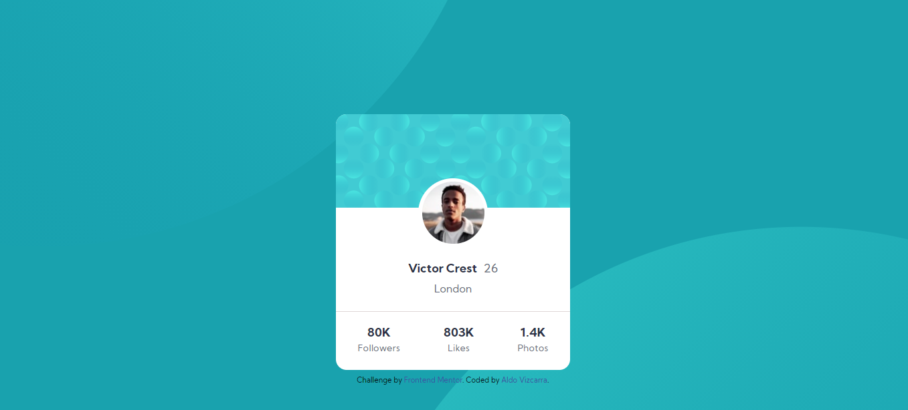

# Frontend Mentor - Profile card component solution

This is a solution to the [Profile card component challenge on Frontend Mentor](https://www.frontendmentor.io/challenges/profile-card-component-cfArpWshJ). Frontend Mentor challenges help you improve your coding skills by building realistic projects. 

## Table of contents

- [Overview](#overview)
  - [The challenge](#the-challenge)
  - [Screenshot](#screenshot)
  - [Links](#links)
- [My process](#my-process)
  - [Built with](#built-with)
  - [What I learned](#what-i-learned)
  - [Continued development](#continued-development)
  - [Useful resources](#useful-resources)
- [Author](#author)
- [Acknowledgments](#acknowledgments)

## Overview

Profile Card

### The challenge

- Build out the project to the designs provided

### Screenshot

### Links

- Solution URL: [https://github.com/aldovizcarra/Profile-Component]
- Live Site URL: [https://aldovizcarra.github.io/Profile-Component/]

## My process

First I created the html markup. I then created the background first. It was hard to recreate the background, so I had some help from a discord server. 
After creating the background, I made the profile card using flexbox.

### Built with

- Semantic HTML5 markup
- CSS custom properties
- Flexbox

### What I learned

During this project I learned how to crop background images.

### Continued development

I want to continue learning css flexbox and other aspects of css, like css grid and bootstrap.

### Useful resources

- [Kevin Powell Discord](https://discord.gg/wqTAvQJE) - This helped me recreate the background.

## Author

- Website - [Aldo Vizcarra](https://github.com/aldovizcarra)
- Frontend Mentor - [@aldovizcarra](https://www.frontendmentor.io/profile/aldovizcarra)

## Acknowledgments

Thanks to the people on the Kevin Powell discord server.
